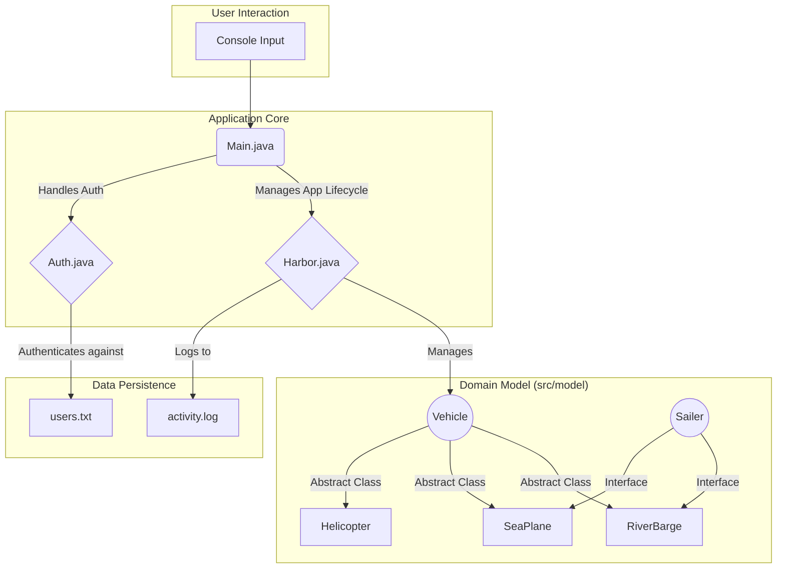

<div align="center">

```
      +-------------------------------------------+
      |    // MARINE MGMT & PORT ADMIN SYSTEM //   |
      +-------------------------------------------+
               /|
     _______/ --| 
    /     /     /|
   /     /     / |
  /____ /     /  |
 (____ /_____/  /
  |          | /
  |__________ |/
```

**A Java-based console application demonstrating core OOP architecture in a simulated harbor environment.**

</div>


---

## System Blueprint

This project is a functional blueprint of Object-Oriented Design. The architecture emphasizes separation of concerns, modularity, and runtime flexibility through strategic use of abstraction, inheritance, and interfaces.



---

## Core Modules & Data Flow

| Module | Role & Responsibilities | Interacts With |
| :--- | :--- | :--- |
| **`Main.java`** | **Application Orchestrator:** Acts as the entry point and main controller. Manages the primary user menu and directs traffic between the `Auth` and `Harbor` modules. | `Auth.java`, `Harbor.java` |
| **`Auth.java`** | **Authentication Controller:** Handles all user registration and login logic. Encrypts and validates credentials against the persistent storage. | `data/users.txt` |
| **`Harbor.java`** | **Operations Hub:** Manages the fleet of vehicles. Contains the core business logic for adding, operating, and docking vehicles, leveraging polymorphism for uniform handling. | `model/*`, `data/activity.log`|
| **`model/*`** | **Domain Logic & Blueprints:** Contains all data structures. `Vehicle.java` provides an abstract template, while concrete classes (`RiverBarge`, etc.) provide specific implementations. The `Sailer` interface defines a "dockable" capability. | `Harbor.java` |

---

## Data Persistence Layer

The system uses a simple, file-based persistence model for portability and transparency. No database is required.

- **`data/users.txt`**
  - **Purpose:** Stores user credentials.
  - **Schema:** `username:hashed_password`
  - **Description:** Each line represents a unique user, ensuring secure and persistent login sessions.

- **`data/activity.log`**
  - **Purpose:** Provides a complete audit trail of system events.
  - **Schema:** `[YYYY-MM-DD HH:MM:SS] - [USER_ACTION] - Details`
  - **Description:** Logs every significant action, from login attempts to vehicle operations, for monitoring and debugging.

---

## Launch Sequence

Follow these steps to get the system operational.

1.  **Clone the Repository**
    ```bash
    git clone https://github.com/your-username/harbor-management-system.git
    cd harbor-management-system
    ```

2.  **Compile & Run**
    -   Open the project in a Java-compatible IDE (IntelliJ, VS Code, Eclipse).
    -   Locate and run the `Main.java` file.
    -   The console application will start and guide you through the login and operational menus.

---


